# Feature Description

In this section you will find a small description of the features that can be extracted with the code, for more detail each one has the link that will take you to the original paper.

---

[I3D](https://arxiv.org/pdf/1705.07750.pdf): Based on the benefits of using the parameters learned by a 2D convolutional network, Inflated 3d ConvNets is proposed. The idea is to transform 2D models with good performance to 3D models. For this, a 2D network is trained with boring videos (repeated images in a video sequence), and then the weights learned by the 2D network are projected to a third dimension, in order to obtain NxNxN cubic filters. Finally, the following is proposed as the inflated architecture:

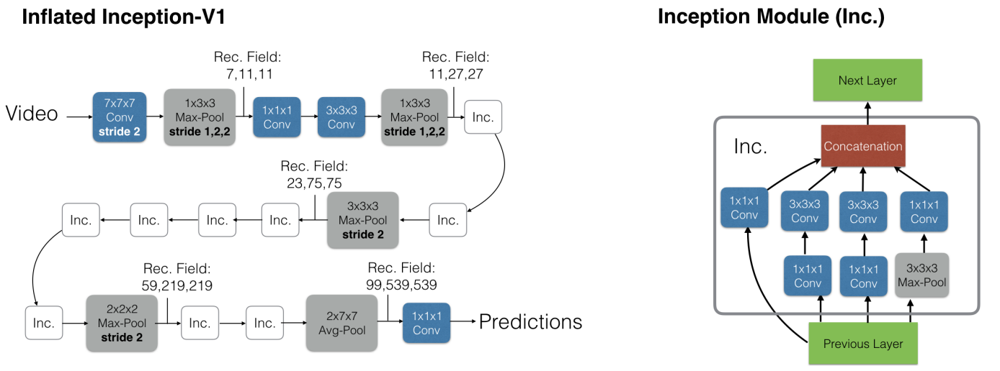

It should be noted that this type of architectures can experience benefits when combined with a parallel block of optical Flow, adding improvements of approximately 3 points in the action classification task.

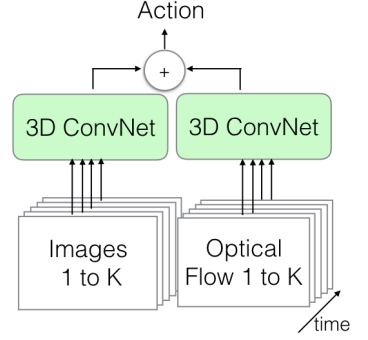

[C2D](https://arxiv.org/pdf/1711.07971.pdf): Used as a baseline in the work proposing non-local blocks, this network is proposed to isolate the effects of temporality in contrast to an inflated architecture. The architecture is a simple ResNet-50 network that absorbs temporal information only in the pooling layers.

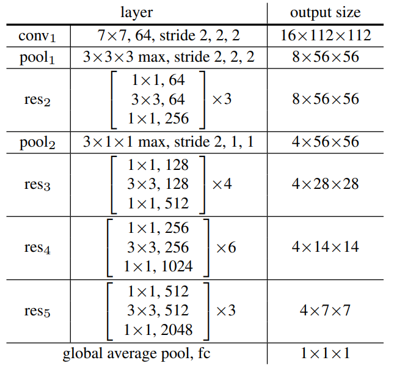

[Non-local](https://arxiv.org/pdf/1711.07971.pdf): They are operators that allow to capture the long-range dependencies of a video. These building blocks can be applied in many computer vision architectures improving the absorption of the temporal component in them. This is due to the fact that in the videos the interactions occur between distant pixels in a space of time, for this reason it is necessary to use operators that allow to relate the position $x_i$ of a frame with $x_j$ of another frame. This can be done through the non-local operator for deep neural networks, which is defined by:

$$
y_i=\dfrac{1}{C(\hat{x})} \sum_{\forall j } f(x_i, \hat
{x}_j)g(\hat{x}_j)
$$

From the equation, $C(x)$ represents a normalization factor, $f$ computes a scalar representing the ratio between pixels and $g$ represents an embedding transformation.

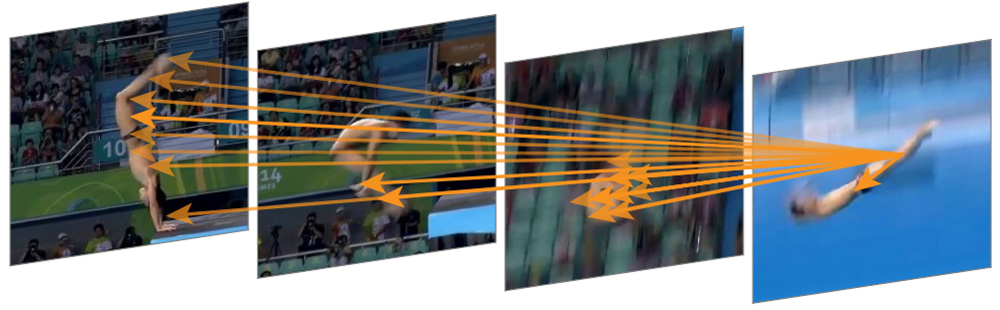

Finally the block is defined by the equation:

$$z_i = W_zy_i+x_i$$

In it $x_i$ represents the residual connection that allows inserting the non local block in any pre-trained model without breaking the initial behavior. On the other hand, $W_g$, $W_{\theta}$ and $W_{\phi}$ represent half the number of channels of x, following a bottleneck design to halve the computation performed by the block.

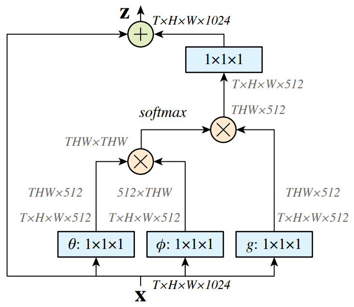

[Multi-grid](https://arxiv.org/pdf/1912.00998.pdf): The idea of this work is to decrease the trade-off of accuracy loss that is generated by fast training. The way to do this is by using variable mini-batches with different spatio-temporal resolutions that allow to speed up the training. This multigrid training is possible because the video models are compatible with input data that vary in space and time dimensions due to the weight operators they share.

In this way, two cycles are proposed for training, which are carried out in a calendarized way: the short cycle and the long cycle. In the case of the short cycle, the information of the temporal and spatial component is reduced, applying this cycle in most of the files, thus taking advantage of a fast training, reducing by half the spatio-temporal component. In the case of the short cycles, they are cycles of one iteration that only manipulate the spatial component of the videos, generating slower training but to capture more temporal information from the videos.

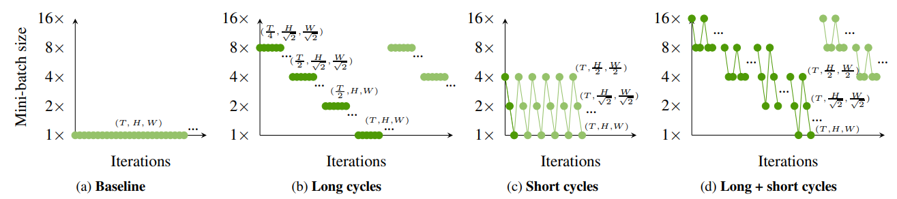

[SlowFast](https://arxiv.org/pdf/1812.03982.pdf)

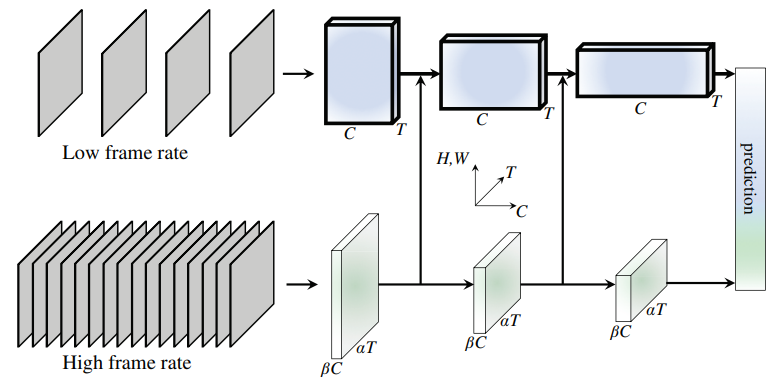

[Mvit-v1](https://arxiv.org/pdf/2104.11227.pdf):

Unlike conventional training with Transformers, where channel capacity and resolution are kept constant throughout the network, Multiscale Transformers have several stages where the channel-resolution scale varies. The idea is to perform a hierarchical expansion through different stages, starting with the original image resolution but a small channel dimension, expanding the channel capacity while reducing the spatial resolution at each stage. In this way, the first layers of the architecture operate at high spatial resolution to model simple low-level visual information, due to the smallness of the channels. Leaving the last layers capable of absorbing the temporal component.

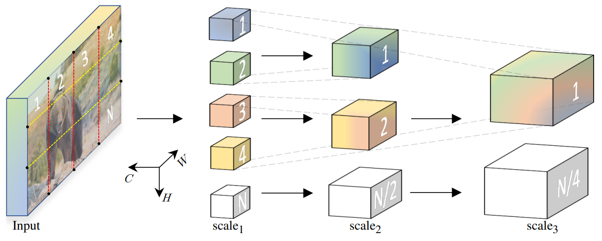

As mentioned above, MViT in each of its stages expands the width of the D channel and reduces the L resolution of the inputs. To perform the downsampling inside the Transformers blocks, MViT proposes the Pooling Attention layers. These layers receive a sequence $X \in \R^{L \times D}$ on which linear projections ($W$) and pooling operators ($P$) are applied:

$$Q=P_Q(XW_Q), K=P_K(XW_K), V=P_V(XW_V)$$

Finally:

$$Z= Attn(Q, K, V) = Softmax(QK^T/\sqrt{D})V$$

Polling attention allows to reduce the resolution between different stages of MViT by pooling on the Q tensor, on the other hand, it significantly reduces the computational and memory complexity of all tensors by pooling each of their operators.

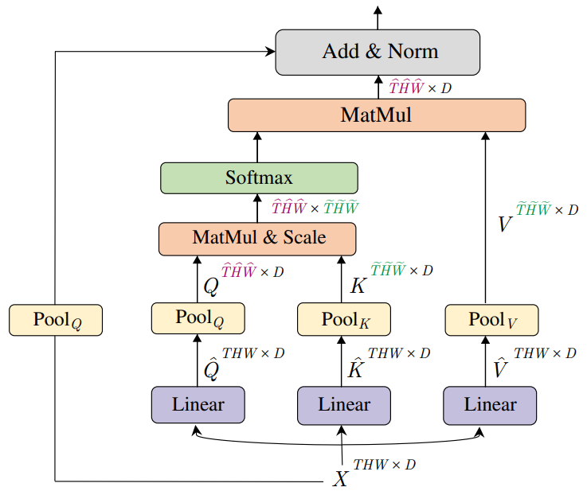

[Mvit-v2](https://arxiv.org/pdf/2112.01526.pdf):

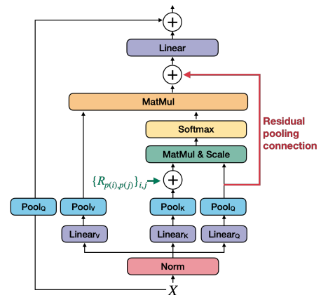

[RevMvit](https://openaccess.thecvf.com/content/CVPR2022/papers/Mangalam_Reversible_Vision_Transformers_CVPR_2022_paper.pdf):

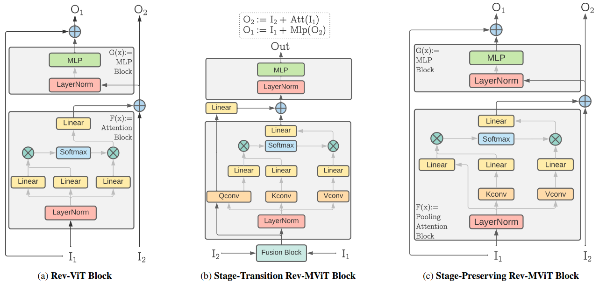

[X3D](https://arxiv.org/pdf/2004.04730.pdf)

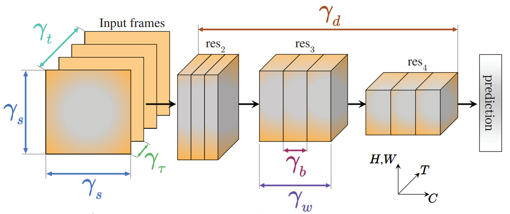

