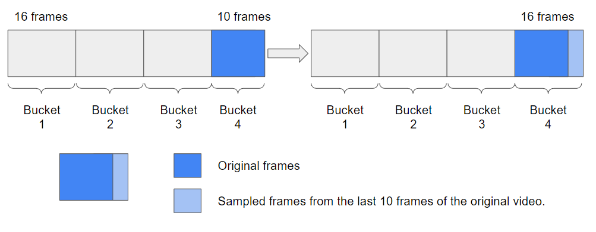

# 🎥 Features Extractor pySlowFast 🎥

The following code has as main objective to obtain video-action features using pretrained models from the [PySlowFast](https://github.com/facebookresearch/SlowFast) framework. The code provided here is focused only on obtaining features using the library Decord.

The logic used for the extraction of features is generating an output prior to the head of each model arranged in the pySlowFast framework. In this way we obtain for each architecture a temporal component referring to each time segment.


> If you want to use the code read the "installation" and "How to use" section. For the execution of the script it is necessary to set/define in the configuration file some relevant inputs for each model.

# Methodology

Pretrained models with different sampling rates are used to obtain the features. In this way, the frames are iteratively traversed respecting the frame rate of each of the models. For those videos that have a number of frames with a multiplicity different from the frame rate of the models, the last bucket is filled with the random sampling of the last frames to obtain the temporal information.



# Installation

To install and run the current code, you must install the [pySlowFast framework](https://github.com/facebookresearch/SlowFast/blob/main/INSTALL.md). In other hand, you must install:

```
pip install scipy
pip install moviepy
pip install decord
```

Note: Sometimes `moviepy` may give some problems to execute the code, in that case please try this:

```cmd
pip uninstall moviepy
pip install moviepy
```

# How to run

To execute the code see the following instructions, in [HOWTOUSE.md](HOWTOUSE.md) you will find the execution script for each supported model (see supported models here) and in [checkpoints](#checkpoints) you will find the different models pretrained by Meta.

# Supported Models

To load weights for Resnet, SlowFast and MViT models, use the following [weights](https://github.com/facebookresearch/SlowFast/blob/main/MODEL_ZOO.md).

| Model                       | Training Dataset       | Status             | Link                                                                                                                                | Filename                           | Commentary |
| --------------------------- | ---------------------- | ------------------ | ----------------------------------------------------------------------------------------------------------------------------------- | ---------------------------------- | ---------- |
| C2D NOPOOL                  | K400                   |                    | https://dl.fbaipublicfiles.com/pyslowfast/model_zoo/kinetics400/C2D_NOPOOL_8x8_R50.pkl                                              | C2D_NOPOOL_8x8_R50.pkl             |            |
| C2D_8x8_R50                 | K400                   | No probada         | https://dl.fbaipublicfiles.com/pyslowfast/model_zoo/ava/pretrain/C2D_8x8_R50.pkl                                                    | C2D_8x8_R50.pkl                    |            |
| I3D_8x8_R50                 | K400                   | FULL PROBADA       | https://dl.fbaipublicfiles.com/pyslowfast/model_zoo/kinetics400/I3D_8x8_R50.pkl                                                     | I3D_NLN_8x8_R50.pkl                |            |
| I3D_NLN_8x8_R50             | K400                   | FULL PROBADA       | https://dl.fbaipublicfiles.com/pyslowfast/model_zoo/kinetics400/I3D_NLN_8x8_R50.pkl                                                 | I3D_NLN_8x8_R50.pkl                |            |
| MVIT_B_32x3                 | K400                   | Probar con MViTv1  | https://drive.google.com/file/d/194gJinVejq6A1FmySNKQ8vAN5-FOY-QL/view?usp=sharing                                                  | k400.pyth                          |            |
| MVITv2_S_16x4               | K400                   | FULL PROBADA       | https://dl.fbaipublicfiles.com/pyslowfast/model_zoo/mvitv2/pysf_video_models/MViTv2_S_16x4_k400_f302660347.pyth                     | MViTv2_S_16x4_k400_f302660347.pyth |            |
| SLOW_8x8_R50                | K400                   | FULL PROBADA       | https://dl.fbaipublicfiles.com/pyslowfast/model_zoo/kinetics400/SLOWONLY_8x8_R50.pkl                                                | SLOWONLY_8x8_R50.pkl               |            |
| SLOWFAST_8x8                | K400                   | FULL PROBADA       | https://dl.fbaipublicfiles.com/pyslowfast/model_zoo/kinetics400/SLOWFAST_8x8_R50.pkl                                                | SLOWFAST_8x8_R50.pkl               |            |
| SLOWFAST_16x8_R50           | Charades               |                    | https://dl.fbaipublicfiles.com/pyslowfast/pyslowfast/model_zoo/multigrid/model_zoo/Charades/SLOWFAST_16x8_R50.pkl                   | SLOWFAST_16x8_R50.pkl              |            |
|                             | Charades               |                    | https://dl.fbaipublicfiles.com/pyslowfast/pyslowfast/model_zoo/multigrid/model_zoo/Charades/SLOWFAST_16x8_R50_multigrid.pkl         |                                    |            |
| SLOWFAST_16x8_R50_multigrid | K400                   | PROBLEMA EJECUCION | https://dl.fbaipublicfiles.com/pyslowfast/pyslowfast/model_zoo/multigrid/model_zoo/Kinetics/SLOWFAST_8x8_R50_stepwise_multigrid.pkl | SLOWFAST_16x8_R50_multigrid.pkl    |            |
| SLOWFAST_16x8_R101_AVA      | Something-Something V2 | PROBLEMA EJECUCIÓN | https://dl.fbaipublicfiles.com/pyslowfast/pyslowfast/model_zoo/multigrid/model_zoo/SSv2/SLOWFAST_16x8_R50_multigrid.pkl             | SLOWFAST_16x8_R101_AVA             |            |
| X3D_M                       | K400                   | FULL PROBADA       | https://dl.fbaipublicfiles.com/pyslowfast/x3d_models/x3d_m.pyth                                                                     | x3d_m.pyth                         |            |
| X3D_S                       | K400                   | FULL PROBADA       | https://dl.fbaipublicfiles.com/pyslowfast/x3d_models/x3d_s.pyth                                                                     | x3d_s.pyth                         |            |
| rev-MViT                    | K400                   | NO SE HA PROBADO   | https://dl.fbaipublicfiles.com/pyslowfast/rev/REV_MVIT_B_16x4.pyth                                                                  | REV_MVIT_B_16x4.pyth               |            |
